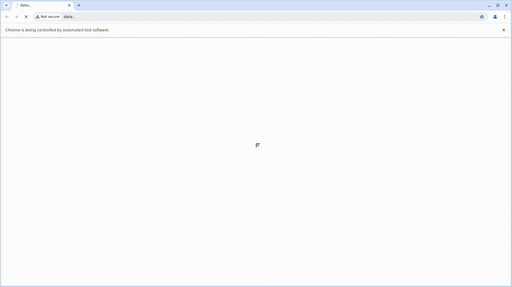

# Проект по автоматизации тестирования онлайн-сервиса электронных и аудиокниг 

## :world_map: Содержание

- [Технологии и инструменты](#gear-технологии-и-инструменты)
- [Список реализованных проверок в автотестах](#white_check_mark-список-реализованных-проверок-в-автотестах)
- [Запуск тестов в Jenkins с параметрами](#rocket-Запуск-тестов-в-Jenkins-с-параметрами)
- [Отчет о результатах тестирования в Allure-reports](#bar_charts-Отчет-о-результатах-тестрования-в-Allure-reports)
- [Статистика запуска тест-планов и отчеты в Allure TestOps](#bar_chart-Статистика-запуска-тест-планов-и-отчеты-в-Allure-TestOps)
- [Уведомление в Telegram о результатах прогона тестов с использованием бота](#email-Уведомление-в-Telegram-о-результатах-проверки-с-использованием-бота)
- [Видео-отчет прохождения UI-автотеста на Selenoid](#movie_camera-Видео-отчет-прохождения-теста-на-Selenoid)
- [Видео-отчет прохождения Mobile-автотеста](#movie_camera-Видео-отчет-прохождения-Mobile-автотеста)

####  [Сайт онлайн-сервиса Litres](https://www.litres.ru/)

## :dart: Цель проекта

Тестирование основных функций онлайн-сервиса, позволяющих пользователям пройти успешную авторизацию, найти интересующую книгу, добавить книгу в корзину, 
добавить книгу в список отложенных книг. А также отсутствиии авторизации при неверно указанном пароле.

## :gear: Технологии и инструменты

## :white_check_mark: Список реализованных проверок в автотестах 

## UI-тесты

- Проверка успешной авторизации пользователя
- Проверка отсутствия авторизации при вводе неверного пароля
- Разлогин пользователя
- Поиск книги через строку поиска по автору
- Поиск книги через каталог по жанру
- Добавление книги в "Отложенные"
- Создание списка книг
- Добавление книги в корзину
- Удаление книги из корзины

## API-тесты

- Добавление книги в корзину
- Поиск печатной книги по названию и автору
- Неуспешный поиск печатной книги по названию
- Добавление книги в "Отложенные"
- Удаление книги из "Отложенных"
- Авторизация с неверно указанным паролем

## Mobile-тесты

## :rocket: Запуск тестов в Jenkins с параметрами

Сборка, параметризация и запуск проекта производятся с помощью Jenkins. При каждом запросе на тестирование браузера Selenoid запускает новый Docker-контейнер и останавливает его после закрытия браузера. Перед запуском можно указать версию браузера (в данном случае запуск тестов проводился на браузере Chrome версии 125.0). Также в параметрах добавлена возможность выбора набора тестов (UI или API), на которые будут запущены. 

## :bar_chart: Отчет о результатах тестирования в Allure-reports

После прохождения тестов автоматически формируется отчет в Allure Report. Allure формирует подробный отчет о результатах прогона тестов. Кастомные фильтры и листенеры делают отчет максимально понятным. Например, в отчет пишутся все селекторы и методы Selene, отчеты формируются по категориям.
После окончания выполнения автотестов по каждому из них в отчете доступны скриншоты, лог консоли браузера и видеозапись выполнения теста.

Общий результат прогона UI-тестов

Список UI-тестов

Пример результата прохождения UI-теста

Общий результат прогона API-тестов

Список API-тестов

Пример результата прохождения API-теста

## :bar_chart: Статистика запуска тест-планов и отчеты в Allure TestOps

Также настроена интеграция с Allure TestOps., что продоставлят возможность просмотра результата выполнения автотестов, создания ручных тестов, а также через запуск автотестов. В Allure TestOps разработана удобная система предоставления отчетов по результатам запуска тестов. 

### Пример Dashboard с общими результатами тестирования

### Общий список всех кейсов, имеющихся в системе

### Пример результата прохождения UI-теста

### Пример результата прохождения API-теста

## :email: Уведомление в Telegram о результатах прогона тестов с использованием бота

Настроено автоматическое оповещение о результатах прохождения тестов в Telegram-бот с полной информацией о прогоне и ссылкой на Allure

### Результат прогона UI-тестов

### Результат прогона API-тестов 

## :movie_camera: Видео-отчет прохождения UI-автотеста на Selenoid

Пример видеозаписи выполнения UI-теста.

